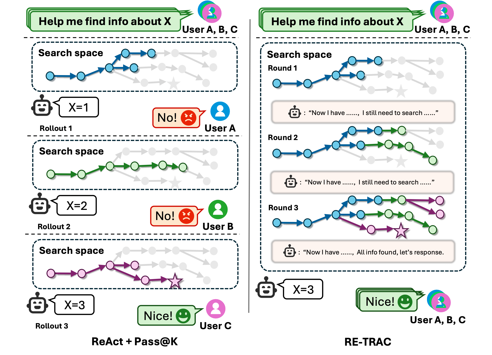
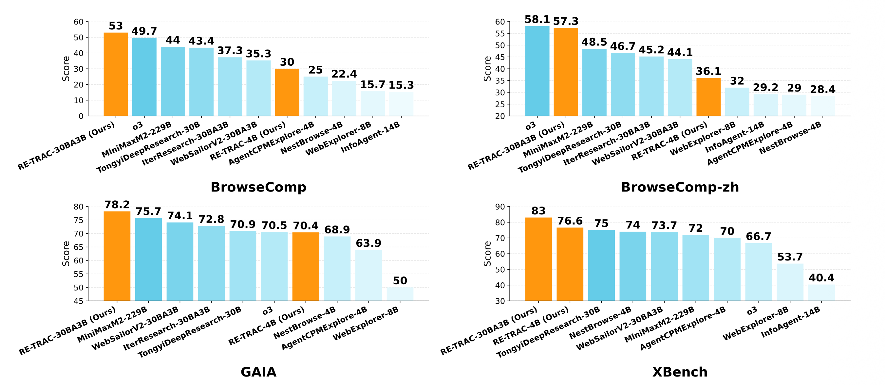

# Microsoft InfoAgent Series

> You can check the paper of [InfoAgent](https://arxiv.org/abs/2509.25189) and [RE-TRAC](https://arxiv.org/abs/2602.02486).
> <br> You Can Try our [RE-TRAC 30B](https://huggingface.co/spaces/JialiangZhu/RE-TRAC) Domo now 
> <br>🔥Stay tuned for more updates!

- [**RE-TRAC**](retrac/README.md) (Preprint 2026) - RE-TRAC: REcursive TRAjectory Compression for Deep Search Agents
- **InfoAgent** (Preprint 2025) - InfoAgent: Advancing Autonomous Information-Seeking Agents


## News
* `[2026-2-3]`:🔥We plan to release RE-TRAC-4B and RE-TRAC-30B-A3B. Stay tuned!
* `[2026-2-3]`:🔥We release [RE-TRAC 30B](https://huggingface.co/spaces/JialiangZhu/RE-TRAC) Domo 
* `[2026-2-3]`:🔥We release [RE-TRAC](https://arxiv.org/abs/2602.02486) paper
    > **Re-TRAC (REcursive TRajectory Compression)**, a recursive framework for deep research agents that enables cross-trajectory exploration via structured state compression. On BrowseComp, Re-TRAC outperforms ReAct-style baselines by +15–20% absolute improvement. <br>It supports both prompting and supervised fine-tuning, our SFT-only models reach **30% (4B) and 53% (30B)**.<br>Find more details in [RE-TRAC](retrac/README.md)
    
    
* `[2025-9-29]` We release [InfoAgent](https://arxiv.org/abs/2509.25189) paper.


## Model Performance

Comprehensive evaluation results across multiple benchmarks:

| Model | BrowseComp | BrowseComp-zh | GAIA | XBench | HLE |
|-------|------------|---------------|------|--------|-----|
| **Closed Model** | | | | | |
| Claude-4.5-Sonnet | 24.1 | 42.4 | 71.2 | 66.0 | 32.0 |
| o3 | 49.7 | 58.1 | 70.5 | 66.7 | 24.9 |
| OpenAI DeepResearch | 51.5 | 42.9 | 67.4 | - | 26.6 |
| GPT-5-high | 54.9 | 63.0 | 76.7 | 77.9 | 42.0 |
| Gemini-3-pro | 37.8 | 51.6 | 74.8 | - | 38.3 |
| **Model  > 70B** | | | | | |
| Kimi-K2-Thinking-1T | 60.2 | 62.3 | - | - | 51.0 |
| DeepSeek-V3.2-Thinking-685B | 67.6 | 65.0 | - | - | 40.8 |
| GLM-4.7-358B | 52.0 | 66.6 | - | - | 42.8 |
| MiniMax-M2-229B | 44.0 | 48.5 | 75.7 | 72.0 | 31.8 |
| **Model 15B~70B** | | | | | |
| Tongyi-DeepResearch-30B-A3B | 43.4 | 46.7 | 70.9 | 75.0 | **32.9** |
| IterResearch-30B-A3B | 37.3 | 45.2 | 72.8 | - | 28.8 |
| WebSailor-V2-30B-A3B (RL) | 35.3 | 44.1 | 74.1 | 73.7 | 30.6 |
| **RE-TRAC-30B-A3B (SFT)** | **53.0** | **57.3** | **78.2** | **83.0** | 31.5 |
| **Model < 15B** | | | | | |
| **InfoAgent-14B** | 15.3 | 29.2 | - | 40.4 | - |
| WebExplorer-8B | 15.7 | 32.0 | 50.0 | 53.7 | 17.3 |
| AgentCPM-Explore-4B | 25.0 | 29.0 | 63.9 | 70.0 | 19.1 |
| NestBrowse-4B | 22.4 | 28.4 | 68.9 | 74.0 | - |
| **RE-TRAC-4B (SFT)** | **30.0** | **36.1** | **70.4** | **76.6** | **22.2** |

## Uses

### Direct Intended Uses

- Autonomous information-seeking and deep research tasks.
- Solving complex, multi-step queries by planning, searching, and reasoning with external tools. 
- Benchmarking and evaluating agentic models on tasks requiring long-horizon reasoning.

### Out-of-Scope Uses

- Any use without human oversight, especially in high-stakes or safety-critical domains.
- Applications where provenance, bias, or misinformation risks are not mitigated.

## Risks and Limitations

- The model may inherit biases and inaccuracies from its Wikipedia-based training data.
- There is a risk of propagating false facts or misinformation if deployed without safeguards. 
- The data synthesis pipeline is currently limited to Wikipedia, which may restrict the diversity of generated problems. 

### Recommendations

- Employ human oversight and bias detection mechanisms. 
- Track provenance and ensure responsible deployment.
- Expand the data synthesis pipeline to broader web sources for greater diversity and challenge.
 
## Evaluation

### Testing Data, Factors, and Metrics

- Evaluated on public benchmarks: BrowseComp, BrowseComp-ZH, Xbench-DS. 
- Metrics include accuracy (%), tool call distribution, recall rates, and context length usage.

## Citation
If you find our works useful in your research, please cite our paper:
```bibtex
@misc{zhu2026retracrecursivetrajectorycompression,
      title={RE-TRAC: REcursive TRAjectory Compression for Deep Search Agents}, 
      author={Jialiang Zhu and Gongrui Zhang and Xiaolong Ma and Lin Xu and Miaosen Zhang and Ruiqi Yang and Song Wang and Kai Qiu and Zhirong Wu and Qi Dai and Ruichun Ma and Bei Liu and Yifan Yang and Chong Luo and Zhengyuan Yang and Linjie Li and Lijuan Wang and Weizhu Chen and Xin Geng and Baining Guo},
      year={2026},
      eprint={2602.02486},
      archivePrefix={arXiv},
      primaryClass={cs.CL},
      url={https://arxiv.org/abs/2602.02486}, 
}
@misc{zhang2025infoagentadvancingautonomousinformationseeking,
      title={InfoAgent: Advancing Autonomous Information-Seeking Agents}, 
      author={Gongrui Zhang and Jialiang Zhu and Ruiqi Yang and Kai Qiu and Miaosen Zhang and Zhirong Wu and Qi Dai and Bei Liu and Chong Luo and Zhengyuan Yang and Linjie Li and Lijuan Wang and Weizhu Chen and Yuan Zhang and Xin Li and Zhaoyi Liu and Xin Geng and Baining Guo},
      year={2025},
      eprint={2509.25189},
      archivePrefix={arXiv},
      primaryClass={cs.CL},
      url={https://arxiv.org/abs/2509.25189}, 
}
```


## License

- MIT License.

## Microsoft Privacy Statement

- Plese refer to [Microsoft Privacy Statement](https://go.microsoft.com/fwlink/?LinkId=521839).

